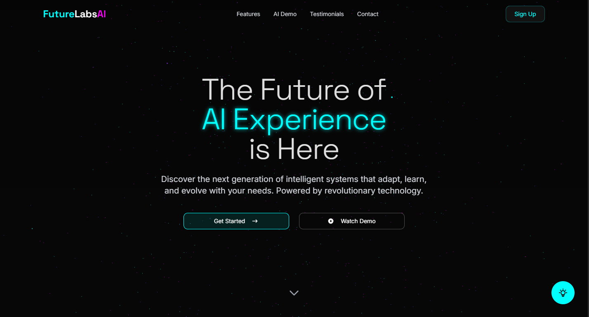
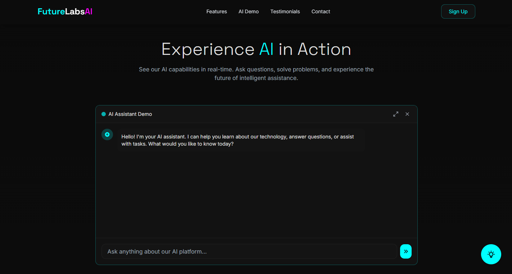
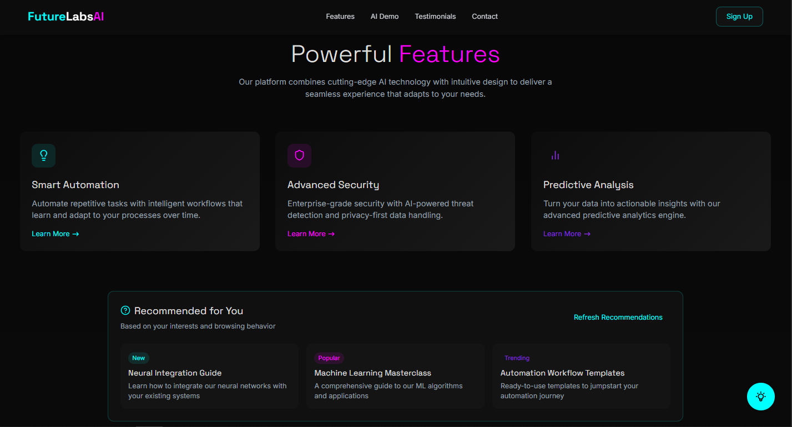

<div align="center">
  <h1>FutureLabs AI</h1>
  <p>A modern, immersive web experience with AI, 3D animations, and futuristic design</p>
  
  <p>
    <a href="#features">Features</a> •
    <a href="#technologies">Technologies</a> •
    <a href="#getting-started">Getting Started</a> •
    <a href="#license">License</a>
  </p>
</div>

## 🚀 Features

- **Immersive 3D Visualizations**: Stunning Three.js powered animations and effects
- **AI Integration**: Real-time AI interactions with Gemini 2.0 Flash model
- **Modern UI/UX**: Sleek design with responsive interfaces and fluid animations
- **Interactive Elements**: Engaging user experiences with reactive components
- **Full-Stack Architecture**: Optimized React frontend with Express backend

## 🧠 AI Capabilities

- **Chat Interface**: Natural language conversations with advanced AI model
- **Personalized Responses**: Context-aware AI assistant for various website sections
- **Intelligent Recommendations**: AI-driven content suggestions based on user interactions
- **Real-time Processing**: Fast response times with optimized backend

## 💻 Technologies

### Frontend
- React 18 with TypeScript
- Three.js for 3D visualizations
- Framer Motion for animations
- TailwindCSS with ShadCN UI components
- TanStack Query for data fetching

### Backend
- Node.js with Express
- Gemini AI API integration
- RESTful API architecture

## ✨ Project Overview

FutureLabs AI showcases cutting-edge AI capabilities in a modern web interface, allowing users to interact with artificial intelligence through an intuitive and visually stunning experience.

### Screenshots

The application features several key sections:

#### 🏠 Hero Section

*Featuring an immersive 3D animation and introduction to our platform*

#### 🔍 AI Chat Demo

*Interactive AI assistant powered by Google's Gemini 2.0 Flash model*

#### ✨ Feature Showcase

*Highlighting the key capabilities and benefits of our platform*

#### 👥 Testimonials

*Success stories from satisfied clients*

## 🛠️ Getting Started

### Prerequisites

- Node.js 18 or higher
- npm or yarn
- Gemini API key (for AI functionality)

### Installation

1. Clone the repository
   ```bash
   git clone https://github.com/Saad-Chaoui/futurelabs-ai.git
   cd futurelabs-ai
   ```

2. Install dependencies
   ```bash
   npm install
   ```

3. Set up environment variables
   Create a `.env` file in the root directory with:
   ```
   GEMINI_API_KEY=your_gemini_api_key
   PORT=5000
   ```

4. Start the development server
   ```bash
   npm run dev
   ```

5. Open your browser
   Navigate to `http://localhost:5000` to see the application running.

## 🧪 Running Tests

```bash
npm test
```

## 📦 Build for Production

```bash
npm run build
```

## 🤝 Contributing

We welcome contributions! Please see our [Contributing Guide](CONTRIBUTING.md) for details.

## 📄 License

This project is licensed under the MIT License - see the [LICENSE](LICENSE) file for details.

## 📞 Contact

- Email: saad99chaoui@gmail.com
- GitHub: [Saad-Chaoui](https://github.com/Saad-Chaoui)

---

<div align="center">
  <sub>Built with ❤️ by Saad Chaoui</sub>
</div>